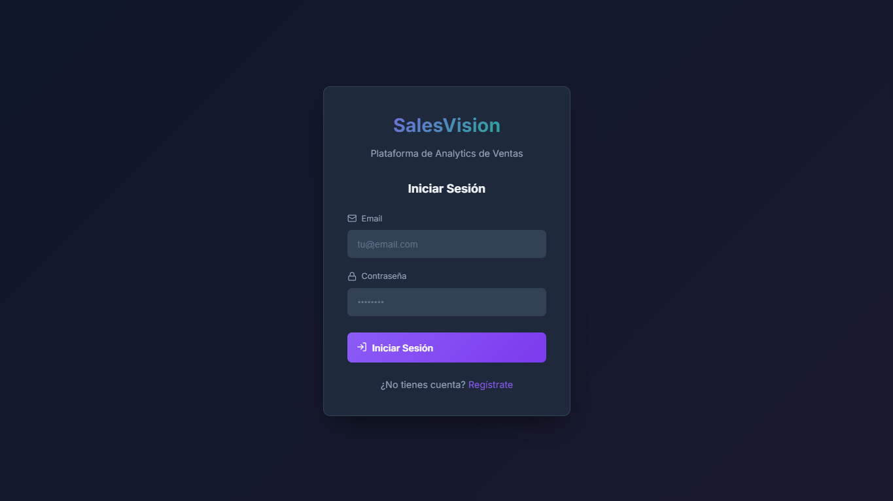
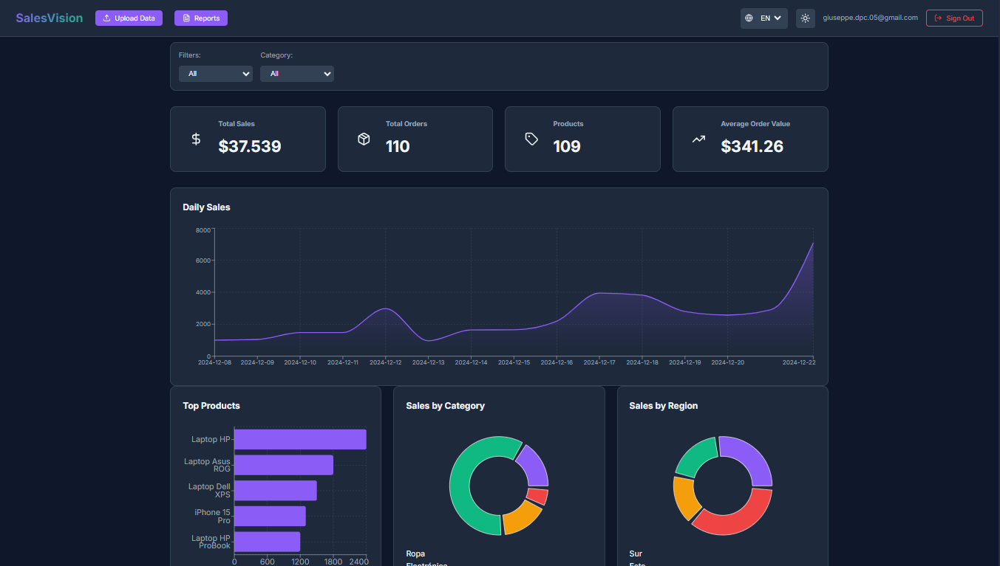
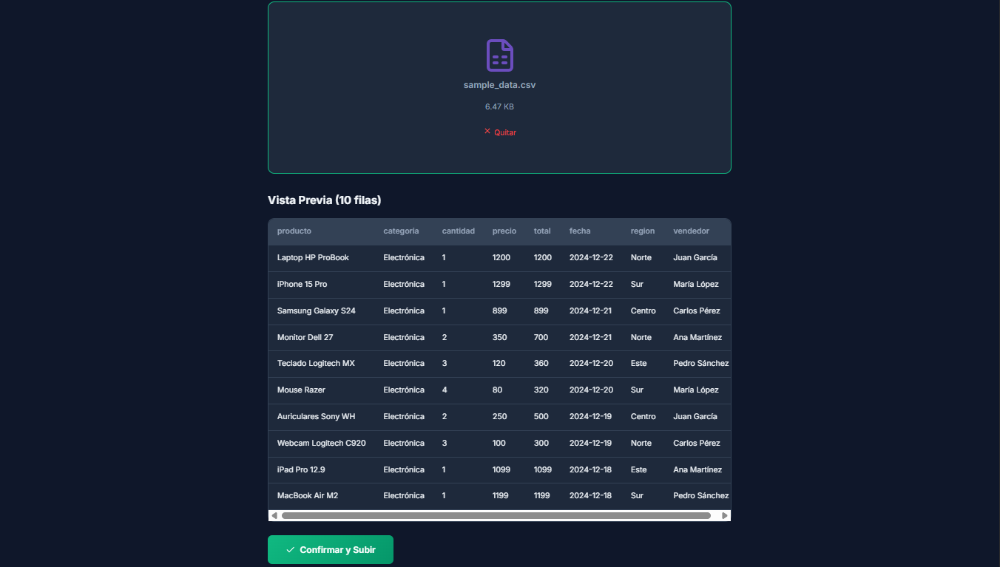
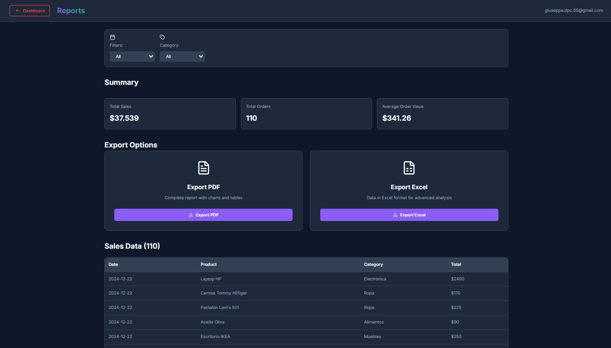

# SalesVision

**Plataforma de Analytics de Ventas** - Dashboard interactivo para visualizar, analizar y exportar datos de ventas empresariales.


---

## Tabla de Contenidos

- [Acerca del Proyecto](#acerca-del-proyecto)
- [Capturas de Pantalla](#capturas-de-pantalla)
- [Arquitectura](#arquitectura)
- [Tecnologías](#tecnologías)
- [Características](#características)
- [Instalación](#instalación)
- [Estructura del Proyecto](#estructura-del-proyecto)
- [Formato de Datos](#formato-de-datos)
- [Despliegue](#despliegue)
- [Licencia](#licencia)

---

## Acerca del Proyecto

Las empresas manejan sus datos de ventas en hojas de Excel dispersas, lo que dificulta obtener insights rápidos sobre el rendimiento del negocio. **SalesVision** resuelve este problema proporcionando:

- Carga de archivos Excel/CSV con datos de ventas
- Visualización de métricas en tiempo real con gráficas interactivas
- Filtros por período y categoría
- Exportación de reportes profesionales en PDF y Excel

| Problema | Solución |
|----------|----------|
| Datos dispersos en múltiples Excels | Centralizado en un dashboard |
| Crear gráficas manualmente | Visualización automática |
| Cálculos manuales de totales | Métricas en tiempo real |
| Reportes hechos a mano | Exportación con un clic |

---

## Capturas de Pantalla

### Login


### Dashboard



### Upload


### Reportes


---

## Arquitectura

```
┌─────────────────────────────────────────────────────────────────┐
│                         FRONTEND                                │
│                    (React + TypeScript)                         │
│  ┌──────────┐  ┌──────────┐  ┌──────────┐  ┌──────────┐        │
│  │  Login   │  │  Upload  │  │Dashboard │  │ Reports  │        │
│  └────┬─────┘  └────┬─────┘  └────┬─────┘  └────┬─────┘        │
└───────┼─────────────┼─────────────┼─────────────┼───────────────┘
        │             │             │             │
        └─────────────┴──────┬──────┴─────────────┘
                             │
                    ┌────────▼────────┐
                    │   SUPABASE      │
                    │   (Backend)     │
                    ├─────────────────┤
                    │ Auth            │
                    │ Database        │
                    │ Storage         │
                    └─────────────────┘
```

---

## Tecnologías

### Frontend

| Tecnología | Versión | Propósito |
|------------|---------|-----------|
| React | 19 | Framework de UI |
| TypeScript | 5.9 | Tipado estático |
| Vite | 7 | Build tool |
| Recharts | 3.6 | Gráficas interactivas |
| Lucide React | - | Iconos SVG |
| Sonner | - | Notificaciones |
| jsPDF | - | Generación de PDFs |
| XLSX | - | Procesamiento Excel |
| ExcelJS | 4.4 | Lectura de archivos |

### Backend

| Servicio | Propósito |
|----------|-----------|
| Supabase Auth | Autenticación de usuarios |
| Supabase Database | PostgreSQL para datos |
| Supabase Storage | Almacenamiento de archivos |

---

## Características

### Funcionalidades

| Característica | Descripción |
|----------------|-------------|
| Upload Inteligente | Drag & drop para Excel y CSV |
| Dashboard Interactivo | 4 métricas + 5 gráficas dinámicas |
| Filtros Avanzados | Por período y categoría |
| Gráfica de Tendencia | Visualiza ventas por día |
| Exportar PDF | Reporte visual con tablas |
| Exportar Excel | 6 hojas con análisis completo |
| Tema Oscuro | Diseño moderno |
| Responsive | Desktop y móvil |

### Excel Export (6 hojas)

1. **Resumen** - Métricas principales y top productos
2. **Datos** - Todas las ventas con fila de totales
3. **Vendedores** - Ranking y estadísticas por vendedor
4. **Regiones** - Análisis por zona geográfica
5. **Temporal** - Mejor día, peor día, promedio diario
6. **Productos** - Catálogo completo con ranking

---

## Instalación

### Prerequisitos

- Node.js 18+
- Cuenta en Supabase (gratuita)

### Paso 1: Clonar y configurar

```bash
git clone https://github.com/tu-usuario/salesvision.git
cd salesvision
npm install
```

### Paso 2: Variables de entorno

Crear archivo `.env` en la raíz:

```env
VITE_SUPABASE_URL=tu_url_de_supabase
VITE_SUPABASE_ANON_KEY=tu_anon_key
```

### Paso 3: Configurar Supabase

Ejecutar en el SQL Editor de Supabase:

```sql
CREATE TABLE sales (
  id UUID PRIMARY KEY DEFAULT gen_random_uuid(),
  date DATE NOT NULL,
  product_name TEXT NOT NULL,
  category TEXT,
  quantity INTEGER NOT NULL,
  unit_price DECIMAL(10,2) NOT NULL,
  total_amount DECIMAL(10,2) NOT NULL,
  region TEXT,
  salesperson TEXT,
  uploaded_by UUID REFERENCES auth.users(id),
  created_at TIMESTAMPTZ DEFAULT NOW()
);

CREATE TABLE uploads (
  id UUID PRIMARY KEY DEFAULT gen_random_uuid(),
  filename TEXT NOT NULL,
  file_path TEXT NOT NULL,
  rows_processed INTEGER,
  status TEXT CHECK (status IN ('pending','processing','completed','error')),
  uploaded_by UUID REFERENCES auth.users(id),
  created_at TIMESTAMPTZ DEFAULT NOW()
);

ALTER TABLE sales ENABLE ROW LEVEL SECURITY;
ALTER TABLE uploads ENABLE ROW LEVEL SECURITY;

CREATE POLICY "Users can view all sales" ON sales FOR SELECT TO authenticated USING (true);
CREATE POLICY "Users can insert sales" ON sales FOR INSERT TO authenticated WITH CHECK (true);
CREATE POLICY "Users can view all uploads" ON uploads FOR SELECT TO authenticated USING (true);
CREATE POLICY "Users can insert uploads" ON uploads FOR INSERT TO authenticated WITH CHECK (true);
```

### Paso 4: Ejecutar

```bash
npm run dev
```

---

## Estructura del Proyecto

```
salesvision/
├── src/
│   ├── pages/
│   │   ├── Login.tsx
│   │   ├── Dashboard.tsx
│   │   ├── Upload.tsx
│   │   └── Reports.tsx
│   ├── hooks/
│   │   └── useAuth.ts
│   ├── lib/
│   │   └── supabase.ts
│   ├── types/
│   │   └── index.ts
│   ├── assets/
│   │   └── SalesVision.png
│   ├── App.tsx
│   └── App.css
├── docs/
│   └── screenshots/
├── sample_data.csv
└── package.json
```

---

## Formato de Datos

El archivo Excel/CSV debe tener estas columnas:

| Columna | Alternativas | Ejemplo | Requerido |
|---------|--------------|---------|-----------|
| producto | product_name, Producto | Laptop HP | Sí |
| total | total_amount, Total | 1500.00 | Sí |
| fecha | date, Fecha | 2024-12-22 | Sí |
| categoria | category | Electrónica | Opcional |
| region | Region | Norte | Opcional |
| vendedor | salesperson | Juan | Opcional |

---

## Despliegue

### Vercel

1. Conectar repositorio a Vercel
2. Agregar variables de entorno:
   - `VITE_SUPABASE_URL`
   - `VITE_SUPABASE_ANON_KEY`
3. Deploy automático

### Build manual

```bash
npm run build
```

---

## Scripts

| Comando | Descripción |
|---------|-------------|
| `npm run dev` | Servidor desarrollo |
| `npm run build` | Build producción |
| `npm run preview` | Preview del build |
| `npm run lint` | Verificar código |

---

## Licencia

MIT

---

## Autor

**Giuseppe**

- GitHub: [@GiuDPC](https://github.com/GiuDPC)
